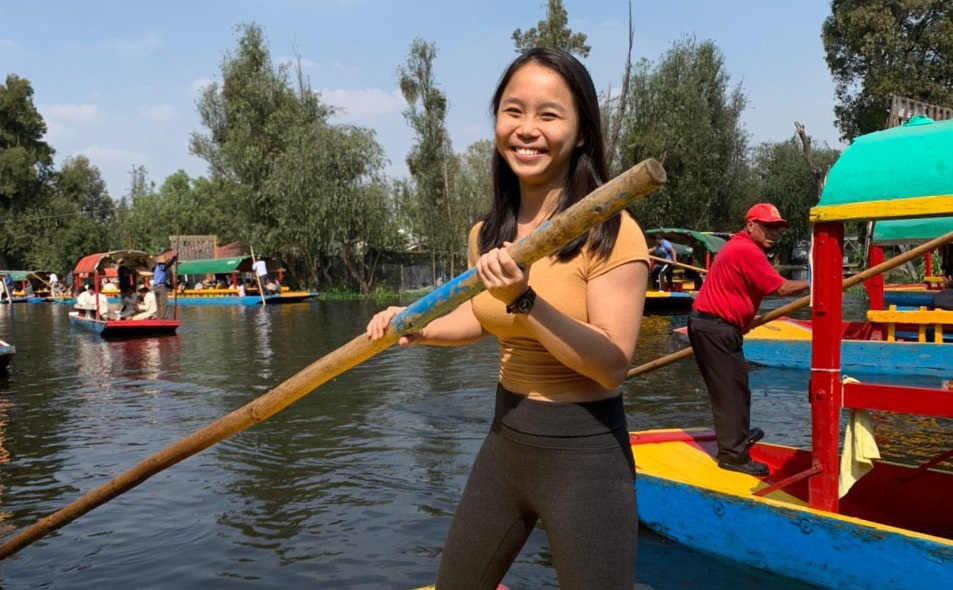

# EPD Alumni Sharing Session 2020
This year's edition is going online! EPD and Freshmore students will be able to interact with EPD Alumni, and know more about their experiences beyond graduation. This event will be held through Microsoft Teams, on March 25th (Week 9, Wednesday), from 6:30pm to 9:00pm. RSVP  [here](https://forms.office.com/Pages/ResponsePage.aspx?id=drd2NJDpck-5UGJImDFiPaaZscqkvmVKuDIKVv5B4edUMThNSTQyNDVKOE5FTTZISDNWMDAzUEcxRi4u) by March 23rd.  

## Participating Alumni (More to be confirmed!)

Name | Biography
:------------: | -------------
**Loy Shi Wei** | Shi Wei graduated from EPD, Electrical Engineering track in 2018, and is currently working at Murata Electronics Singapore. Murata Electronics is a Japanese component manufacturer. He handles sales, marketing and applications, and is currently in charge of the ASEAM and India region. Hence, he would like to share his thoughts so far on working in the electronics industry. 
**Ng Guo Xiang** | Guo Xiang graduated in 2019 from the SUTD-SMU Dual Degree Programme in business and EPD (Electrical Engineering track). Guo Xiang's latest endeavour is in Singtel as a Specialist Management Associate and an enterprise IoT/5G product manager because he believes that there are unique business challenges to be solved in this emerging technology space. |
**Clara Ho** | Clara graduated from EPD under the Computer Engineering track in 2019. Currently, she is in the Home Team Science and Technology Agency (HTX) Associates programme, doing Data Science and Artificial Intelligence work. | 
**Andrew Sng** | Andrew graduated from SUTD under the Electrical Engineering track in 2017. Now an IoT Specialist at GovTech Singapore, he strives to be a technologist for Citizen-Centric Design. He is the hardware technical lead for GovTech Assisted Living Ecosystem (GALE), a system built to support the assisted living infrastructure in Singapore, in bringing technologies for senior citizens.|
**Doron Teh En Tsien** | Reluctant but lucky alien, alumni, current engineering research person and perpetual SUTD-ian; Doron currently exists in what he considers a fascinating university, trying to strike a mildly fascinating work-play life balance. Ask him questions, really, he generally isn't too sure how to start conversations. | 
**Byron Elton Tan** | Byron graduated in 2019 from EPD (Electrical Engineering Track). He is now part of the Home Team Science & Technology Agency (HTX) as an Engineer under Vehicle Systems where he perform technology research and survey, explore feasibility of new technologies integration and adoption, develop prototypes and conduct proof-of-concept trials, as well as perform project risks assessment. |
**Heikern Leong** | Heikern is currently studying his Masters in Energy Science and Technology at ETH Zurich and he had graduated from SUTD-EPD with a specialisation in electrical engineering. During his time at SUTD, he spent time doing research on strain sensing via antenna deformation. He also spent a lot of his time in ring comm developing the SUTD ring and the rebelband for wireless convenience applications. Current research interests relates to the power grid and how renewables will change the way the grid is controlled and regulated. Outside his academic interest, he loves to boulder and climb so feel free to ask him questions on that too.|
**Winnie Neo** | Winnie graduated from EPD (Mechanical Engineering track) in 2019. She then went on to Columbia University in New York to pursue a Master of Science in Mechanical engineering, with a concentration in Robotics and Control. It is a one year coursework-based programme and she will be completing her degree in Summer 2020. Afterwards, she will be returning back to Singapore to serve her scholarship bond with DSTA. |
**Tay Zi Hang**  | Zi Hang graduated from EPD's Class of 2019 from the Mechanical Engineering track. He currently works in Standard Chartered Bank as a Technology & Innovation (T&I) International Graduate. He has had experience in departments such as Cash Product Development in Transaction Banking, and Digital & Online Banking in Retail Banking, working on various projects including blockchain-enabled cross-border payments, data visualisation, web automation, and customer experience. He is currently with the bank's T&I Corporate, Commercial & Institutional Banking Site Reliability Engineering (SRE) and Strategy & Business Management teams. | 

## Background
The EPD Alumni Sharing Session was started with the aim of obtaining the following objectives: 
- Build up an EPD alumni network to collect feedback from the alumni to improve the quality of education in EPD.
- Provide a platform for EPD students to engage with Alumni to provide help and insight for the upcoming graduation. 
- Provide a platform for Freshmore students to know about the opportunities EPD provide to its students.

